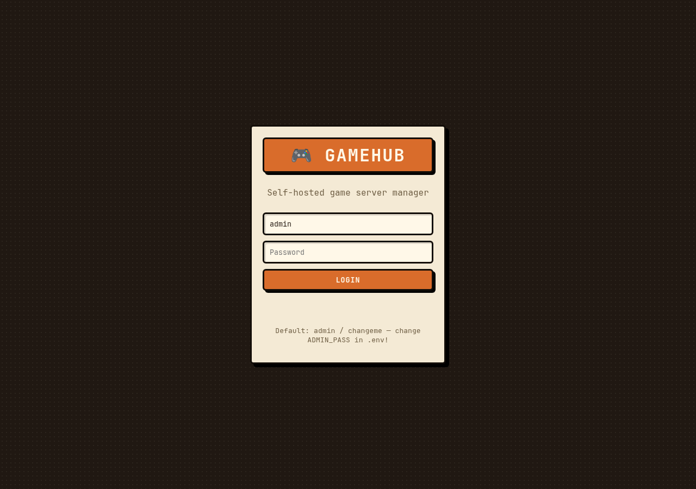

# 🎮 GameHub — self-hosted game server manager

Control **Palworld** (start/stop/restart, live console, RCON player admin, PalWorldSettings editor, backups, updates, metrics) + easily add **Minecraft, Valheim, Project Zomboid, or any Docker game**.

Stack: **Python FastAPI backend** + vanilla JS frontend, Docker Compose deploy. The manager controls game containers via the Docker socket.

> Unofficial community project. Not affiliated with Pocketpair, Valve, Mojang, or the authors of the game-server Docker images used in the templates.

## Features

- **Lifecycle**: Start / Stop / Restart, state-aware buttons (can't Start twice or Delete while running)
- **Live console**: websocket log stream with auto-reconnect + polling fallback, RCON command box with per-game quick buttons
- **Players**: list via RCON, Kick/Ban (Palworld uses `KickPlayer`/`BanPlayer <steamid>`)
- **Config**: raw file editor + parsed Palworld `OptionSettings` form
- **Mods tab**: per-game mods folder, one-click catalog installs, URL install, file upload (zips auto-extract)
- **Backups**: one-click tar.gz of server volumes
- **⬆ Update**: pulls latest image + recreates (how SteamCMD games update) with live progress (`⏳ Updating…` → `✅ done`)
- **Metrics**: CPU / RAM / players with legend + history chart
- **Share page**: public read-only status page per server (`/share/{id}`) with join address, stats, player names — no login needed
- **Multi-game**: templates for Palworld, Minecraft Java, Valheim, Project Zomboid, Generic/Custom

## Screenshots


*Login screen (retro theme). The dashboard adds server list, live console, players, Palworld settings, mods, backups, metrics + share links.*

## Deploy

### Requirements

- Linux server: Ubuntu 22.04 / 24.04 (Debian works too), 4GB+ RAM for Palworld, SSD recommended
- Docker + Docker Compose plugin (the installer script handles this)
- Ports: **8000/tcp** manager UI. Game ports reachable directly, or via playit tunnel behind CGNAT (see below)

### Option A — one-command (recommended)

```bash
git clone https://github.com/your-username/gamehub.git /opt/gamehub
cd /opt/gamehub
chmod +x setup-server.sh
sudo ./setup-server.sh --admin-pass 'pick-a-strong-password' --with-playit --yes
```

What the script does: installs Docker + UFW (allows ssh + manager port), generates `.env` with a random `SECRET_KEY`, runs `docker compose up -d --build`, optionally installs the playit agent. It prints your UI URL + login at the end.

Flags: `--admin-user admin`, `--port 8000`, `--with-playit`, `--playit-secret KEY` (non-interactive playit claim), `--yes`.

### Option B — manual

```bash
git clone https://github.com/your-username/gamehub.git /opt/gamehub
cd /opt/gamehub
cp .env.example .env
nano .env   # set ADMIN_PASS + SECRET_KEY (openssl rand -hex 32)
docker compose up -d --build
# open http://<server-ip>:8000  login: admin / your ADMIN_PASS
```

### CGNAT / playit.gg setup (e.g. PH ISPs behind CGNAT)

Router port-forward won't work behind CGNAT. The playit agent tunnels out from your server:

```bash
sudo playit
# prints https://playit.gg/claim/xxxx -> open it, login, claim agent
```

Then in https://playit.gg/account/tunnels → Add Tunnel:
- UDP `127.0.0.1:8211` — Palworld game
- UDP `127.0.0.1:27015` — Palworld query

Paste the playit address into GameHub (Env tab → Public join address) and share the `/share/{id}` page with players. Keep RCON `25575` internal — do NOT tunnel it.

Docker-mode alternative: put your agent key in `.env` as `PLAYIT_SECRET=...` then `docker compose --profile playit up -d`.

### Updates & maintenance

```bash
cd /opt/gamehub
git pull
docker compose up -d --build        # update manager
# game updates: use ⬆ Update button in UI (pulls latest SteamCMD image + recreates)
# backups live in ./backups/ - copy them off-site
```

Put the UI behind HTTPS in production (Cloudflare Tunnel, Caddy, or Nginx reverse proxy). If proxying through Cloudflare: turn OFF Bot Fight Mode, add a WAF Skip + Cache Bypass for `/api/*`, keep WebSockets ON.

## Usage

1. **+ New** → pick template (Palworld etc), name `palworld-1`, set RCON/admin password → Create + Start.
2. **Console tab**: live logs + RCON command box. Quick buttons: `ShowPlayers`, `Save`, `Broadcast …`.
3. **Players tab**: list via `ShowPlayers`, Kick/Ban buttons.
4. **Config tab**: raw `PalWorldSettings.ini` editor. **Palworld⚙ tab**: form editor for `OptionSettings=(...)`.
5. **Mods tab**: install from catalog / URL / file upload, then Restart to load.
6. **Env tab**: public join address + share link, JSON env (server name, passwords, ports). Save → **Update** button recreates container to apply.
7. **Backups tab**: one-click tar.gz of volume → `./backups/`. Restore: stop server, then `tar -xzf backups/<file> -C /var/lib/docker/volumes/<vol>/_data --strip-components=1`.
8. **⬆ Update**: pulls latest image + recreates (how SteamCMD games update), with progress shown in the UI.

## Mods

Each template declares a mods folder (Palworld `Pal/Binaries/Linux/Mods`, Minecraft `mods/`, Valheim `plugins/`, Zomboid `Server/mods`). Note: **Palworld UE4SS/script mods are Windows-server-only** — on the Linux image only `.pak`/config mods work. For `!give`-style mods you need a Windows-based Palworld server (e.g. a Wine/Proton image).

## Adding other games

**No-code path (Generic template)**: + New → Generic/Custom → paste any Docker image + ports/env. Done.

**Template path (recommended)**: edit `manager/app/games/templates.py` — copy e.g. the `valheim` block:

```python
_register(GameTemplate(
    id="rust", name="Rust",
    image="didstopia/rust-server:latest",
    ports=[{"host": 28015, "container": 28015, "protocol": "udp"}],
    env_defaults={"RUST_SERVER_NAME": "GameHub Rust", ...},
    volumes={"data": "/steamcmd/rust"},
    rcon_supported=True, rcon_port=28016,
    player_list_command="status",
    mods_dir="mods",
))
```

Restart manager → new template appears in UI. Fields:
| field | meaning |
|---|---|
| `image` | Docker image |
| `ports` | host→container defaults |
| `env_defaults` | default env vars (overridable per server) |
| `volumes` | named-volume key → container path |
| `rcon_*` | RCON support, port, password env key |
| `config_files` | editable files inside volume |
| `helpful_commands` | quick buttons in console |
| `mods_dir` / `mod_catalog` | mods folder + one-click catalog |

Player parsing per game lives in `manager/app/rcon_helpers.py::parse_players` — extend for new formats.

## Project layout

```
gamehub/
  setup-server.sh         # one-command server installer (+ playit for CGNAT)
  docker-compose.yml      # manager + optional playit profile
  .env.example            # placeholders only - real .env is git-ignored
  .gitignore
  manager/
    Dockerfile
    requirements.txt
    app/
      main.py             # REST + WS endpoints, static hosting
      config.py auth.py models.py
      docker_service.py   # container lifecycle + instances.json
      rcon.py             # Source RCON client
      rcon_helpers.py     # per-server RCON target + player parsing
      palworld_config.py  # OptionSettings parser/serializer
      backups.py
      mods.py             # mods folder + URL installs
      games/base.py       # GameTemplate + ServerInstance dataclasses
      games/templates.py  # ★ add games here ★
    static/               # frontend (index.html, share.html, app.js, styles.css, favicon.svg)
  docs/                   # screenshots for this README
  data/ backups/          # runtime (volumes, instances.json, archives) - git-ignored
```

## API

Auth: all `/api/*` except `POST /api/login` need `Authorization: Bearer <token>`. Public share endpoints need no auth.

- `GET /api/templates`, `GET/POST /api/servers`, `GET/DELETE /api/servers/{id}`
- `POST /api/servers/{id}/start|stop|restart`, `POST /api/servers/{id}/update` + `GET .../update/status`
- `GET /api/servers/{id}/stats`, `GET /api/servers/{id}/logs`, `WS /api/servers/{id}/logs/ws?token=`
- `POST /api/servers/{id}/rcon {command}`, `GET /api/servers/{id}/players`
- `GET/PUT /api/servers/{id}/env`, `PUT /api/servers/{id}/public-address`
- `GET/PUT /api/servers/{id}/config`, `GET/PUT /api/servers/{id}/palworld-settings`
- `GET /api/servers/{id}/mods`, `POST .../mods/install`, `POST .../mods/upload`, `DELETE .../mods/{name}`
- `GET /api/backups`, `POST /api/servers/{id}/backup`, `DELETE /api/backups/{f}`, `GET /api/system`
- `GET /public/servers/{id}` (no auth — status, join address, stats, player names only), `GET /share/{id}` page

## Security checklist (do this before going public)

- [ ] `.env` has a strong `ADMIN_PASS` and a random 32-byte `SECRET_KEY` (never commit `.env` — it's git-ignored; only `.env.example` with placeholders is tracked)
- [ ] UI served over HTTPS (reverse proxy / Cloudflare Tunnel), not plain HTTP
- [ ] RCON ports firewalled to localhost / trusted IPs only — never tunneled publicly
- [ ] Host OS + Docker kept patched; backups copied off-site
- [ ] Note: the manager mounts the Docker socket, which is root-equivalent on the host — anyone with the admin login effectively has host root. Guard that password.
- [ ] Template `changeme-*` defaults are placeholders: always set real RCON/admin passwords when creating a server

## Dev (no docker)

```bash
cd manager
pip install -r requirements.txt
MOCK_DOCKER=true ADMIN_PASS=dev-only SECRET_KEY=dev-only-32-bytes-long-xxxx uvicorn app.main:app --reload
# http://127.0.0.1:8000
```

## License

No license file ships with this repo yet — add one (MIT recommended) before accepting contributions, otherwise others have no legal right to reuse the code.
